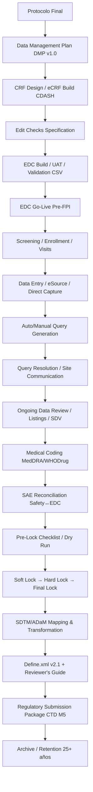

# Head of Clinical Data Management: datos de ensayos clínicos, EDC, calidad de datos, estadística clínica

## Definición y alcance

**Head of Clinical Data Management (Head of CDM)** = líder ejecutivo responsable de la **integridad, calidad, trazabilidad y entrega oportuna** de los datos generados en **ensayos clínicos** (Fase I-IV, estudios observacionales, registros, evidencia real-world/RWE), desde el diseño del protocolo hasta el *database lock* y la entrega de paquetes de envío regulatorio (SDTM/ADaM).

**Misión**: garantizar que los datos clínicos sean **completos, consistentes, precisos, válidos y trazables** (ALCOA+: Atributable, Legible, Contemporaneous, Original, Accurate + Complete, Consistent, Enduring, Available) para soportar decisiones médicas, regulatorias y de negocio.

**Reporte típico**: VP/Director Biostatistics & Programming, Head of Clinical Operations, Chief Medical Officer, o VP Clinical Development. En organizaciones grandes, rol separado de Head of Biostatistics; en medianas/pequeñas, a menudo combinado.

## Responsabilidades core

| Dominio | Responsabilidades clave | Entregables / KPIs |
|---------|------------------------|---------------------|
| **Estrategia CDM** | Definir *Data Management Plan (DMP)* alineado a protocolo, *Risk-Based Quality Management (RBQM)*, *CDISC standards* strategy | DMP aprobado pre-FPI; % estudios con DMP v1.0 en 30 días protocolo final |
| **Diseño CRF / eCRF** | Liderar diseño *Case Report Forms* (paper/eCRF), *edit checks*, *derivation rules*, *codelists* (CDISC CT), *visit windows* | CRF finalizado pre-FPI; *edit check coverage* >95% campos críticos; *user acceptance testing (UAT)* firmado |
| **EDC Administration** | Selección/configuración *Electronic Data Capture* (Medidata Rave, Oracle Clinical/InForm, Veeva Vault CDMS, Castor, REDCap, OpenClinica); *build*, *test*, *deploy*, *migration* | *EDC go-live* pre-FPI; *system validation* (CSV/GAMP5); *uptime* >99.5%; *change control* <48h |
| **Gestión consultas (Query Management)** | Diseño *edit checks* (auto-query, manual query), *query resolution workflow*, *aging reports*, *query aging* <7 días (crítico), <14 días (mayor), <30 días (menor) | *Query rate* <5% campos; *resolution rate* >95% 30 días; *open queries* pre-lock <2% |
| **Codificación médica** | *MedDRA* (AE/SAE, historia médica, procedimientos), *WHO Drug Dictionary* (concomitantes, tratamientos estudio) — *autoencoding* + *manual review* | *Coding consistency* >98%; *verbatim-to-preferred term* mapping auditado |
| **Reconciliación SAE** | *Safety database* (Argus, ARISg, Oracle Argus) ↔ *EDC* — *bidirectional reconciliation* (SAE ↔ AE CRF, onset/outcome, seriousness, causalidad) | *Reconciliation rate* 100% pre-lock; *discrepancies* resueltas <48h |
| **Limpieza / *Data Review*** | *Listing reviews* (médico, estadístico, CDM), *targeted SDV* (Source Data Verification) basado riesgo (RBQM), *central monitoring* (KRI, *site performance metrics*) | *Critical data fields* 100% SDV; *non-critical* risk-based; *CDR (Clinical Data Review)* meetings quincenales |
| **Cierre de base de datos (Database Lock)** | *Soft lock* → *Hard lock* → *Final lock*; *pre-lock checklists* (queries, SAE, coding, protocol deviations, missing data, *protocol compliance*); *lock sign-off* (CDM, Biostats, Medical, PM, Sponsor) | *Time to lock* <30 días post-LPLV (Last Patient Last Visit); *re-lock rate* <5% |
| **Entregas regulatorias (SDTM/ADaM)** | Transformación *raw EDC* → *SDTM* (dominios: DM, AE, CM, EX, LB, VS, EG, QS, etc.) → *ADaM* (ADSL, ADAE, ADLB, ADEFF, ADTTE, ADPP) → *Define.xml* (v2.1) → *Reviewer's Guide* (RG) — *P21 validator* pass | *SDTM/ADaM compliance* 100% *P21*; *Define.xml* valid; *RG* completo; *submission package* listo *CTD Module 5* |
| **Gestión proveedores (CRO / Vendor Management)** | *RFP*, *vendor qualification*, *SLA*, *KPIs* (timeliness, quality, query resolution, coding accuracy), *oversight*, *audits* | *Vendor scorecard* trimestral; *audit findings* crítico/menor; *transition plans* |
| **Innovación / Estándares** | Adopción *CDISC* (SDTM, ADaM, SEND, CDASH, ODM, Define.xml), *eSource* (ePRO, eCOA, wearable, EHR-to-EDC *direct data capture*), *AI/ML* (auto-query, *anomaly detection*, *predictive query*), *decentralized trials* (DCT) | *CDISC compliance* 100% nuevos estudios; *eSource adoption* >50% estudios nuevos; *pilot AI* resultados medidos |

## Flujo de trabajo típico (Lifecycle CDM)

## Estándares y regulaciones clave

| Estándar / Guía | Ámbito | Versión actual (2025-26) |
|-----------------|--------|---------------------------|
| **CDISC SDTM** (Study Data Tabulation Model) | Estructura datos tabulados envío regulatorio | SDTM v1.7 / SDTM-IG v3.3 |
| **CDISC ADaM** (Analysis Data Model) | Datasets análisis estadístico trazables | ADaM v2.1 / ADaM-IG v1.3 |
| **CDISC CDASH** (Clinical Data Acquisition Standards Harmonization) | Diseño CRF estandarizado | CDASH v2.1 |
| **CDISC Define.xml** | Metadatos datasets (origen, derivación, codelists) | Define.xml v2.1 |
| **CDISC SEND** | Datos no clínicos (toxicología) | SEND v3.1 |
| **ICH E6(R3)** | GCP — *Good Clinical Practice* (incl. RBQM, *quality by design*, *oversight*) | E6(R3) 2023 implementación 2025 |
| **ICH E9(R1)** | *Estimands* — alineación pregunta científica, endpoint, análisis | E9(R1) 2019 |
| **ICH E2B(R3)** | Farmacovigilancia — transmisión casos seguridad (SAE) | E2B(R3) |
| **ICH M11** | Especificación transmisión datos clínicos (eCTD v4.0, HL7 FHIR) | M11 2022 |
| **FDA CDER CBER** | *Guidance: Electronic Submission of Clinical Trial Data*, *Computerized Systems Used in Clinical Investigations*, *Data Standards* | Actualizaciones continuas |
| **EMA** | *Guideline on Computerised Systems and Electronic Data*, *eSubmission* | 2023-24 |
| **21 CFR Part 11** | Registros electrónicos / firmas electrónicas | Vigente + *FDA Draft Guidance 2023* |
| **GAMP 5 / EU Annex 11** | Validación sistemas informatizados | GAMP 5 2nd Ed 2022 |
| **ISO 14155** | Investigación clínica dispositivos médicos | 2020 |

## Métricas de desempeño (KPIs CDM)

| Categoría | KPI | Target best-in-class |
|-----------|-----|----------------------|
| **Timeliness** | *Time to First Query* | <24h post-data-entry |
| | *Query Resolution Time* (median) | Crítico <48h, Mayor <7d, Menor <14d |
| | *Database Lock Timeline* | LPLV → Soft Lock ≤21d; Soft→Hard ≤7d; Hard→Final ≤7d |
| **Quality** | *Query Rate* (queries/100 fields) | <5% |
| | *Critical Data Field Completeness* | 100% |
| | *SAE Reconciliation Rate* | 100% pre-lock |
| | *Coding Accuracy* (audit sample) | >99% |
| | *Protocol Deviation Capture* | >90% known deviations documented |
| **Efficiency** | *Cost per Patient* (CDM) | Benchmark por fase/área terapéutica |
| | *EDC Build Cycle Time* | Protocol final → EDC go-live <6 semanas |
| | *Re-lock Rate* | <3% |
| **Innovation** | *eSource Adoption* (% studies) | >50% new studies |
| | *AI/ML Query Automation* (% auto-resolved) | >30% queries auto-closed |
| | *CDISC Compliance* (P21 pass rate) | 100% new studies |

## Organización típica del equipo CDM

| Rol | Foco | Ratio típico (por estudio Fase III global) |
|-----|------|--------------------------------------------|
| **Head of CDM / CDM Director** | Estrategia, presupuesto, *vendor mgmt*, *stakeholder alignment*, *escalation* | 1 por programa / TA |
| **Senior CDM / CDM Lead** | *Study-level* ownership: DMP, CRF, *lock*, *submission* | 1 por estudio pivotal |
| **CDM Specialist / Associate** | *Query management*, *coding*, *reconciliation*, *listings review* | 1-2 por estudio (según tamaño) |
| **EDC Administrator / Builder** | *Build*, *UAT*, *change control*, *migration*, *user admin* | 1 por 3-5 estudios |
| **Medical Coder** (MedDRA/WHODrug) | *Autoencoding* review, *verbatim mapping*, *coding queries* | 1 por 2-3 estudios (o *centralized coding team*) |
| **Data Standards / CDISC Specialist** | *SDTM/ADaM mapping*, *Define.xml*, *P21 validation*, *submission support* | 1 por 3-5 estudios (o *centralized standards team*) |
| **RBQM / Data Quality Analyst** | *KRI design*, *central monitoring*, *risk assessment*, *site performance dashboards* | 1 por programa / TA |
| **Vendor Manager / CRO Oversight** | *SLA*, *KPIs*, *audits*, *issue escalation*, *transition* | 1 por región / CRO estratégico |

## Tecnologías *core* (Stack CDM 2025-26)

| Categoría | Herramientas líderes | Tendencias |
|-----------|---------------------|------------|
| **EDC / CDMS** | Medidata Rave, Veeva Vault CDMS, Oracle Clinical/InForm, Castor EDC, REDCap, OpenClinica, Clinion, TrialKit | *Unified platform* (EDC + RTSM + eCOA + Safety + Analytics), *no-code build*, *AI-assisted build* |
| **Safety / PV** | Oracle Argus, ArisGlobal LifeSphere, Veeva Vault Safety, SAS Safety | *Bidirectional integration* EDC↔Safety (SAE reconciliation automatizada) |
| **Medical Coding** | MedDRA/WHODrug *autoencoding* (Medidata Coder, Veeva Coder, Oracle Argus Coder, *in-house NLP/ML*) | *ML-assisted coding* >95% auto-accept; *active learning* human-in-the-loop |
| **SDTM/ADaM / Standards** | Pinnacle 21 (P21), CDISC Library, *Define.xml* editors (Pinnacle, XML4Pharma), *OpenCDISC* validator, *Cytel* / *SAS* / *R* (admiral, haven, xportr) | *Automated mapping* (EDC→SDTM via *metadata-driven*); *ADaM* via *admiral* (R) / *SAS macros* (CDISC pilot) |
| **Analytics / Visualization** | Spotfire, Tableau, Power BI, SAS Visual Analytics, JMP Clinical, R Shiny / Quarto | *Real-time listings*, *KRI dashboards*, *central monitoring*, *patient profiles* |
| **eSource / DCT** | *ePRO/eCOA* (Medidata eCOA, Signant Clinical Ink, Veeva Vault eCOA, Clario, Kayentis), *wearables/sensors* (ActiGraph, Biovotion, Apple ResearchKit), *EHR-to-EDC* (FHIR, CDISC ODM/XML, *direct data capture* — Epic, Cerner, Oracle Health) | *BYOD*, *decentralized trials*, *home health nursing*, *telemedicine visits* |
| **AI / ML aplicado** | *Auto-query* (rule-based + ML), *anomaly detection* (isolation forest, LSTM), *predictive query* (next query prediction), *medical coding NLP* (BERT/ClinicalBERT), *protocol digitization* (NLP → CRF/EDC build) | *Human-in-the-loop* mandatory; *explainability* regulatory; *validation* ML models (GxP ML) |
| **Collaboration / CTMS integration** | Veeva Vault CTMS, Medidata CTMS, Oracle Siebel CTMS, BioClinica, *Jira/Confluence* (issue tracking), *Teams/Slack* (notificaciones queries) | *Single source of truth* study metadata; *bi-directional sync* EDC↔CTMS |

## RBQM (Risk-Based Quality Management) — papel CDM

Per ICH E6(R3): *Quality by Design* → *Critical to Quality (CtQ) Factors* → *Key Risk Indicators (KRIs)* → *Mitigation Strategies* → *Oversight Plan*.

**CDM lidera / co-lidera**:
- Identificación *Critical Data Fields* (primary/key secondary endpoints, safety, PK, inclusion/exclusion, randomization, informed consent).
- Diseño *KRI thresholds* (ej. *query rate*, *SAE reporting timeliness*, *protocol deviation rate*, *visit compliance*, *data entry lag*, *site enrollment vs projection*).
- *Central Monitoring* dashboards (site-level, country-level, study-level) → *trigger* on-site *SDV* / *remote SDV* / *focused monitoring*.
- *Risk Assessment* actualizado cada *Data Review Meeting* / *DMC* / *DSUR*.

## Desafíos críticos 2025-26 y respuestas

| Desafío | Respuesta CDM |
|---------|---------------|
| **Complejidad protocolo** (adaptativo, basket/umbrella, master protocol, multi-regimen, biomarker-driven) | *Modular CRF design*, *dynamic EDC* (conditional modules), *metadata-driven SDTM mapping*, *close collab Biostats/Medical* desde protocolo |
| **Datos heterogéneos** (ePRO, wearables, imaging, genomics, RWE/EHR, lab central/local) | *CDISC SEND/MIST/SDTM* extensiones; *FAIR data principles*; *semantic interoperability* (FHIR, OMOP CDM); *data lake* arquitectura |
| **Descentralización (DCT)** — *home health*, *telemedicine*, *eConsent*, *ePRO*, *direct-to-patient drug shipment* | *eSource validation*, *offline-first EDC*, *identity verification*, *data privacy* (GDPR/HIPAA/LGPD/PIPL), *site-less* oversight |
| **IA/ML en CDM** — *auto-query*, *coding*, *anomaly detection*, *protocol-to-CRF NLP* | *GxP ML validation* (FDA *Good Machine Learning Practice*), *human-in-the-loop*, *audit trail* decisiones IA, *model monitoring* drift |
| **Entregas regulatorias aceleradas** (rolling review, priority review, conditional approval, real-time oncology review) | *Parallel tracking* SDTM/ADaM durante limpieza; *pre-lock SDTM conversion*; *automated P21 validation*; *submission-ready* datasets pre-lock |
| **Escasez talento CDM** (especialistas CDISC, EDC builders, medical coders) | *Upskilling interno* (SCDM/CDISC certifications), *near-shore/offshore centers of excellence*, *low-code EDC* reduce dependencia builders, *AI-assisted coding* |

## Cross-refs

- [[rol/head-of-clinical-operations]] — operaciones ensayos, sitios, CROs, timelines, presupuestos
- [[rol/head-of-biostatistics]] / [[rol/head-of-clinical-data-management]] — estadística clínica, SAP, TFLs, estimands, *integrated summaries*
- [[rol/head-of-medical-affairs]] — estrategia médica, evidencia, KOLs, *medical monitoring* seguridad
- [[rol/head-of-regulatory-affairs]] — *submission strategy*, *CTD Module 5*, *health authority interactions*, *labeling*
- [[rol/head-of-rd]] / [[rol/head-of-clinical-development]] — *portfolio prioritization*, *go/no-go*, *translational strategy*
- [[rol/head-of-pharmacovigilance]] — *SAE reconciliation*, *signal detection*, *PSUR/PBRER*, *RMP*
- [[dominio/investigacion-clinica]] — diseño ensayos, fases, ética, regulación
- [[dominio/biotecnologia]] / [[dominio/farmaceutica]] — pipeline, desarrollo clínico, acceso mercado
- [[dominio/gestion-de-la-calidad]] / [[dominio/auditoria-de-sistemas]] — GxP, CSV, *data integrity*, *audit readiness*
- [[dominio/etica-de-datos]] / [[dominio/proteccion-de-datos-personales]] — GDPR/HIPAA/LGPD/PIPL, *informed consent*, *anonymization/pseudonymization*
- [[sustrato/estados-unidos/ciencia-de-datos]] — *NIH Genomic Data Sharing*, *All of Us*, *FDA CDER Sentinel*, *Real-World Evidence Program*
- [[sustrato/mexico/salud]] — COFEPRIS, *comité de ética*, *farmacovigilancia*, *ensayos clínicos México*
- [[sustrato/canada/salud]] — Health Canada, *Clinical Trials Regulations*, *Vanessa's Law*, *RWE framework*